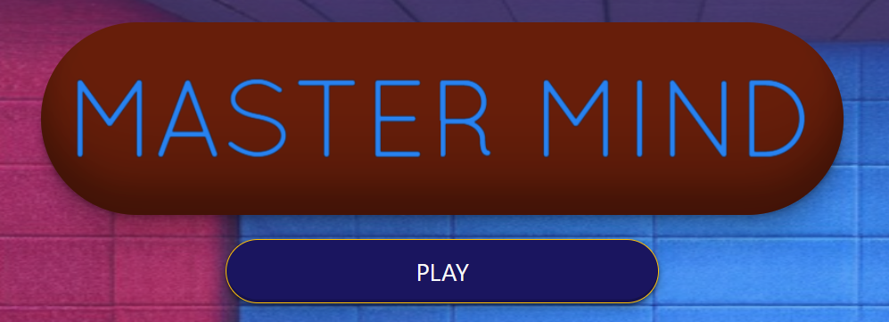
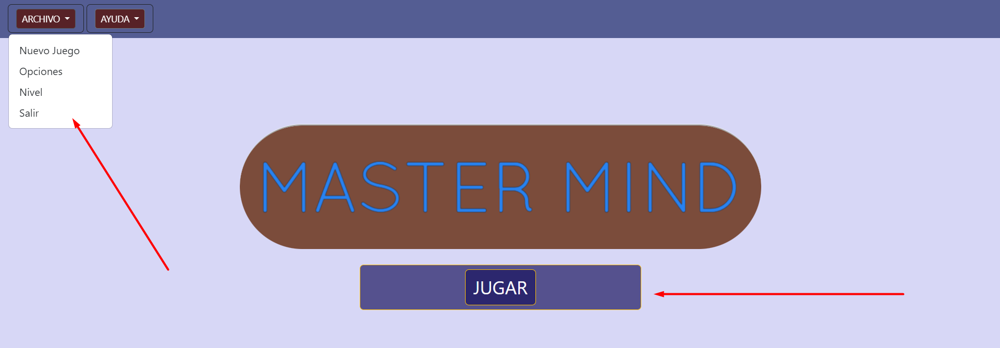
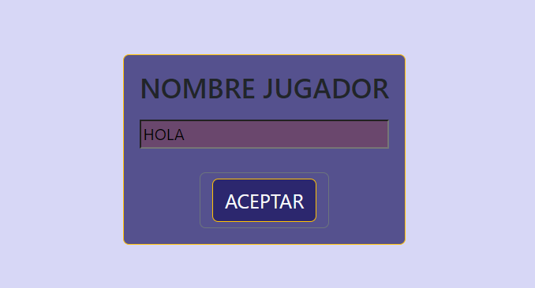
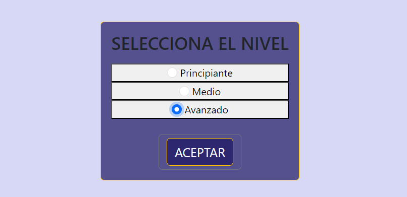
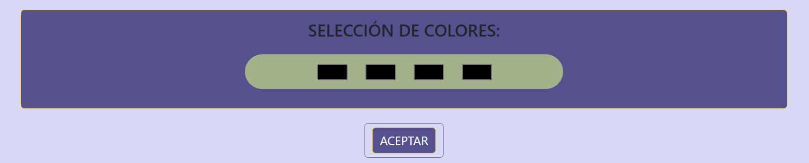
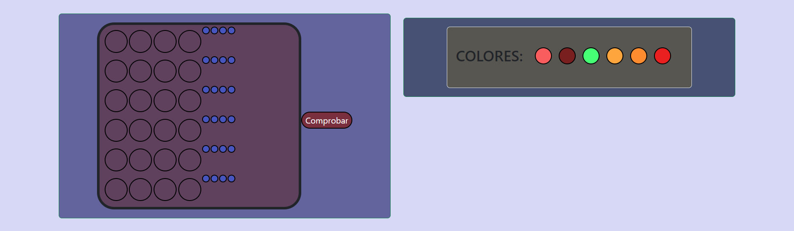
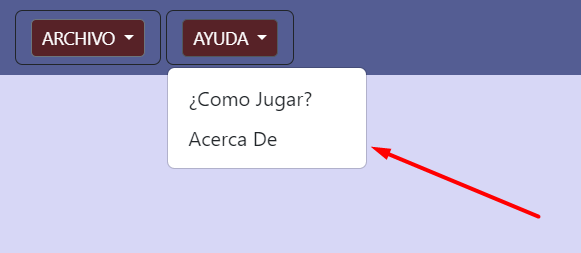
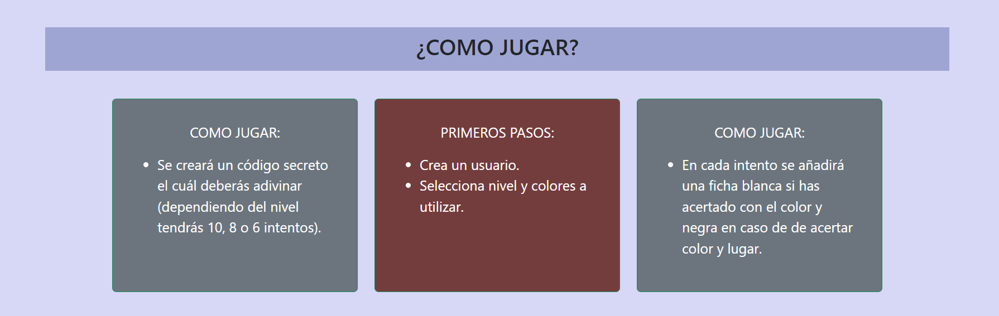
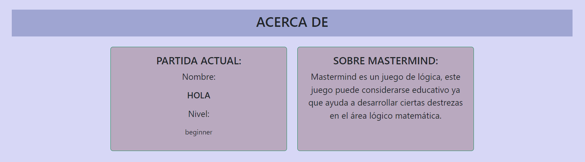

### Proyecto 3 - MASTERMIND

#### Tecnologías utilizadas:

+ JAVASCRIPT.
+ BOOTSTRAP.
+ HTML.
+ CSS.

#### Uso:

Al ingresar a la página principal podremos ver: 
+ El nombre del juego. 
+ Menú de fácil acceso arriba a la izquierda en el cuál podremos acceder a todos y desde todos los archivos del proyecto.
+ Botón de JUGAR para iniciar el juego.

Al clicar en el botón jugar pasaremos a la pestaña para ingresar el nombre.

En esta pestaña escogerá el nivel donde, dependiendo de cuál tendrá 6, 8 o 10 intentos y más colores en la combinación secreta.

En caso de haber hecho clic en 'Principiante' dispondrá de 4 colores para elegir.

Al ingresar en la pestaña del juego se verán do recuadros, uno con el juego y otro con los colores que ha seleccionado.

Si no se tiene conocimientos sobre el juego Master Mind, en el menú ayuda tendrá acceso a '¿Cómo Jugar?', y 'Acerca De'.

En el archivo ¿Cómo Jugar?, se tendrá los tips más importantes para lograr la victoria.

'Acerca De' funcionará para ver el nivel seleccionado y el nombre del usuario (también alguna información sobre el juego).

Sí se acierta en los intentos disponibles, te enviará a la página de la victoria.

Caso contrario serás redirigido a la página 'loser'.

#### Licencia y Copyright:

Se ha obtenido el ícono de:

+ www.iconfinder.com

##### Autor:

Jorge Luis Martin Lorenzo.